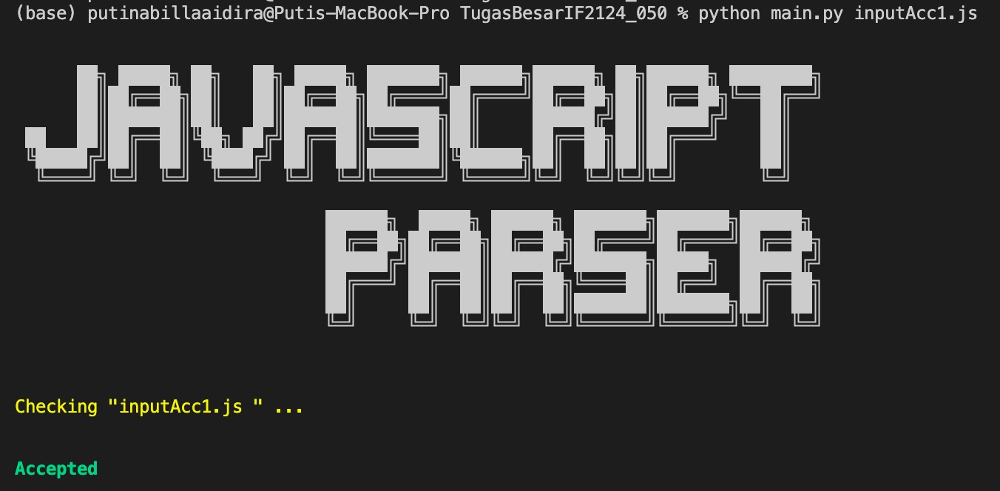

# Parser Bahasa JavaScript (Node.js)
Tugas Besar IF2124 Teori Bahasa Formal dan Otomata

## Daftar Isi
* [Penjelasan Ringkas Program](#penjelasan-ringkas-program)
* [Pre-Requisite Program](#pre-requisite-program)
* [Cara Menjalankan Program](#cara-menjalankan-program)
* [Pembagian Tugas](#pembagian-tugas)
* [Daftar Fitur](#daftar-fitur)
* [Status Pengerjaan](#status-pengerjaan)
* [Screenshot program](#screenshot-program)
* [Struktur Program](#struktur-program)
* [Kontributor](#kontributor)


## Penjelasan Ringkas Program
Menurut Kamus Besar Bahasa Indonesia, parser adalah alat untuk mendeteksi kesalahan sintaksis pada program komputer. Parsing dilakukan dengan mengambil input dalam bentuk instruksi program atau urutan token untuk kemudian dipisahkan menjadi komponen-komponen yang lebih mudah untuk diproses atau dianalisis secara sintaksis. Proses parsing dilakukan untuk mengetahui apakah kode program tersebut ditulis sesuai dengan tata bahasanya, sebelum dijalankan oleh compiler. Parsing digunakan dalam semua bahasa pemrograman tingkat tinggi, salah satunya JavaScript. Program JavaScript Parser ini mengimplementasikan proses parsing file program JavaScript(.js) dengan menerapkan konsep Finite Automata dan Context-Free Grammar. Program ini berbasis CLI (Command Line Interface) dan ditulis dalam Bahasa Pemrograman Python.

## Pre-Requisite Program
1. Pastikan pada device sudah terinstall library sys

## Cara Menjalankan Program
1. Pastikan sudah melakukan kompilasi program
2. Pada root directory jalankan command `python main.py <nama_file>.js`
3. Jika berhasil di run, splash screen JAVASCRIPT PARSER muncul

## Pembagian Tugas
| PIC                               	| JOBDESC                                                                                                                                                                                                                         	|
|-----------------------------------	|---------------------------------------------------------------------------------------------------------------------------------------------------------------------------------------------------------------------------------	|
| 13521050 Naufal Syifa Firdaus    	| Finite Automata Ekspresi<br> Laporan Bab 1, 2, 3, 4     	|
| 13521077 Husnia Munzayana       	| Pre-process<br>AFintie Automata Variabel, Bilangan, dan String<br> Laporan Bab 1, 2, 3, 4, 5     	|
| 13521088 Puti Nabilla Aidira     	| Grammar<br> CNF Converter <br> Laporan Bab 1, 2, 3     	|

## Daftar Fitur
1. Validasi Variabel dengan Finite Automata
2. Validasi Ekspresi dengan Finite Automata
3. Parsing program .js dengan konsep Context-Free Grammar

## Status Pengerjaan
- [x] Validasi Variabel dengan Finite Automata
- [x] Validasi Ekspresi dengan Finite Automata
- [x] Parsing program .js dengan konsep Context-Free Grammar

## Screenshot Program


## Struktur Program
```bash
└───TugasBesarIF2124_050
    ├───doc
    │   └───
    ├───test
    │   ├───inputAcc1.js
    │   ├───inputAcc2.js
    │   ├───inputAcc3.js
    │   ├───inputReject1.js
    │   ├───inputReject2.js
    │   └───inputReject3.js
    ├───CFGDescription.txt
    ├───CNF.txt
    ├───main.py
    ├───globalVariable.py
    ├───validNumber.py 
    ├───validVariable.py 
    ├───expressionCheck.py
    ├───CNFconverter.py
    ├───CYK.py
    └───README.md
```
## Kontributor
1. Naufal Syifa Firdaus     13521050
2. Husnia Munzayana         13521077
3. Puti Nabilla Aidira      13521088


----------------------------------------------------------------------------------------------------------


# TugasBesarIF2124_050
## Tugas Besar IF2124 Teori Bahasa Formal dan Otomata Parser Bahasa JavaScript (Node.js)

GITHUB      : https://github.com/Putinabillaa/TugasBesarIF2124_050.git
<br>
LAPORAN     : https://docs.google.com/document/d/1HhXz45MD3ONAw3p7mACvJmtcekjKlBM2rQ5wuz785mI/edit?usp=sharing
<br>

SPESIFIKASI : https://docs.google.com/document/d/1JodthYhXxtxvxZXdkrC29XP6AzYEQSi7ll9z_fTseA0/edit?usp=sharing
<br>
QnA         : https://docs.google.com/spreadsheets/d/1wdoJPKM_Q4bYNAW7EXH1M5vGi5FSL18DvNo970oaWxQ/edit?usp=sharing
<br>
SUBMISI     : https://forms.gle/fVRxWGW9Km2ozHdq9
<br>

REFERENSI : <br>
Grammar           : https://developer.mozilla.org/en-US/docs/Web/JavaScript/Reference <br>
